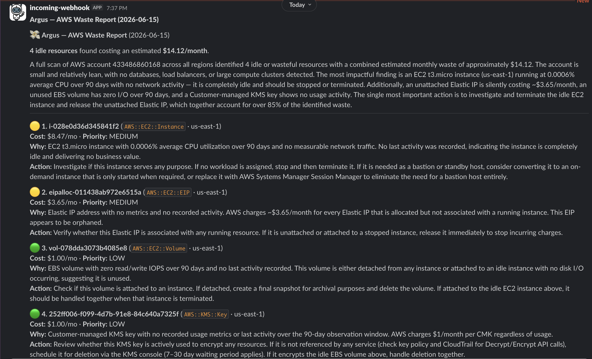

<p align="center">
  
</p>

<p align="center"><strong>AI-powered cloud cost optimization agent for AWS, GCP, and Azure.</strong></p>

Argus finds idle and wasted cloud resources — stopped EC2 instances, unattached EBS volumes, orphaned Elastic IPs, underutilized RDS databases — and delivers a prioritized, AI-reasoned report to Slack every week.

[](https://github.com/vamshisiddarth/argus/actions/workflows/ci.yml)
[](https://www.python.org/downloads/)
[](LICENSE)
[](https://vamshisiddarth.github.io/argus/)

<p align="center">
  
</p>

---

## What it does

Every week (or on demand), Argus:

1. **Discovers** every resource in your cloud account using AWS Resource Explorer / GCP Asset Inventory / Azure Resource Graph
2. **Analyzes** each candidate — CloudWatch/Cloud Monitoring/Azure Monitor metrics, Cost Explorer/BigQuery/Cost Management cost data, and CloudTrail/Audit Log/Activity Log last-activity timestamps
3. **Reasons** about idleness using Claude (via AWS Bedrock, Anthropic API, or Vertex AI) — no hardcoded thresholds
4. **Reports** a compact Slack digest with top findings and a link to a full self-contained HTML report

Example Slack output:

```
Argus — AWS Waste Report (2026-06-17)

💸 $42.65/month estimated waste   📊 4 idle resources across 1 account

Two stopped EC2 instances and a forgotten NAT Gateway account for 72% of
total waste. One EBS volume has had no I/O in over 30 days.

Top findings
🔴  i-0abc123def  ·  EC2 t3.large    ·  $28.40/mo
🔴  nat-0def456   ·  NAT Gateway     ·  $10.80/mo
🟡  vol-orphan    ·  EBS gp3 100GiB  ·  $8.00/mo
🟢  eipalloc-xyz  ·  Elastic IP      ·  $3.65/mo

[ 📄 Full report (HTML) ]   [ vamshisiddarth/argus ]
```

The **Full report** button links to a self-contained HTML file (S3 / GCS / Azure Blob) with a filterable/sortable table and expandable AI reasoning per finding. Works offline, no login required.

---

## Architecture

```
┌─────────────────────────────────────────────────────────┐
│                    Agent Loop (ReAct)                   │
│   Think → Call Tool → Observe → Think → Submit          │
└────────────────────┬────────────────────────────────────┘
                     │
        ┌────────────┴────────────┐
        ▼                         ▼
  CloudAdapter               AIProvider
  (AWS / GCP / Azure)        (Bedrock / Anthropic / Vertex)
        │
   ┌────┴──────────────────┐
   │  list_resources       │  Resource Explorer / Asset Inventory / Resource Graph
   │  get_metrics          │  CloudWatch / Cloud Monitoring / Azure Monitor
   │  get_cost             │  Cost Explorer / BigQuery / Cost Management
   │  get_last_activity    │  CloudTrail / Audit Logs / Activity Log
   └───────────────────────┘
```

**Design principle: Same brain. Different hands. Different home.**
- **Brain** = agent loop + AI reasoning (`core/`) — pure Python, zero cloud imports
- **Hands** = cloud adapters (`adapters/`) — swappable per cloud
- **Home** = entrypoints (`entrypoints/`) — Lambda / Cloud Run / Azure Function

---

## Quick start

### Option A — Docker (fastest)

```bash
docker build --build-arg CLOUD=aws -t argus .

docker run --rm \
  -e ANTHROPIC_API_KEY=sk-ant-... \
  -e DRY_RUN=true \
  -v ~/.aws:/root/.aws:ro \
  argus --cloud aws --run-now --dry-run
```

### Option B — Local Python

**Prerequisites**
- Python 3.13+
- AWS credentials configured (`~/.aws/credentials` or env vars)
- AWS Resource Explorer enabled with an **aggregator index** in `us-east-1`
  (or set `RESOURCE_EXPLORER_REGION` to your aggregator region)
- An Anthropic API key **or** AWS Bedrock access

```bash
git clone https://github.com/vamshisiddarth/argus.git
cd argus
make setup          # creates .venv, installs deps, copies .env.example
```

Edit `.env` — minimum required:

```ini
AI_PROVIDER=anthropic
ANTHROPIC_API_KEY=sk-ant-...

# Remove DRY_RUN or set to false to post to Slack
DRY_RUN=true
SLACK_WEBHOOK_URL=https://hooks.slack.com/services/T.../B.../...
```

```bash
make scan-aws       # runs --dry-run by default
```

**Install only what you need:**

```bash
pip install -r requirements/aws.txt    # AWS only
pip install -r requirements/gcp.txt    # GCP only
pip install -r requirements/azure.txt  # Azure only
pip install -r requirements/dev.txt    # everything + dev tools
```

### Options

```
python main.py --cloud aws --run-now [options]

  --dry-run                  Print Slack payload instead of posting
  --ignore-regions REGIONS   Comma-separated regions to skip (e.g. ap-east-1,me-south-1)
  --ai-provider PROVIDER     anthropic | bedrock (default: anthropic)
  --accounts PATH            Path to accounts.yaml for multi-account mode
```

---

## Deploy to AWS Lambda

Uses [AWS SAM](https://docs.aws.amazon.com/serverless-application-model/latest/developerguide/install-sam-cli.html) — handles packaging and upload automatically. No S3 bucket needed.

### Single account

```bash
make deploy-aws
# or manually:
cd deploy/aws/single-account
sam build && sam deploy --guided
```

`sam deploy --guided` walks you through parameters (Slack webhook, region, AI provider) and saves them to `samconfig.toml` for future deploys. Subsequent deploys are just `sam deploy`.

The stack creates:
- Lambda function (runs weekly via EventBridge)
- IAM role with least-privilege read-only permissions
- S3 bucket for full JSON report storage (90-day retention)

### Multi-account

**Hub account** (runs Argus):

```bash
make deploy-aws-multi
# or manually:
cd deploy/aws/multi-account/hub
sam build && sam deploy --guided
```

**Each spoke account** (read-only IAM role only — no Lambda):

```bash
aws cloudformation deploy \
  --template-file deploy/aws/multi-account/spoke-role.yaml \
  --stack-name Argus-Spoke \
  --capabilities CAPABILITY_IAM \
  --parameter-overrides HubAccountId=<hub-account-id>
```

The hub stack output includes the `HubRoleArn` — use it as the `HubRoleArn` parameter for spoke deployments.

---

## Deploy to GCP (Cloud Run)

```bash
# Authenticate
gcloud auth application-default login

# Set your project
gcloud config set project YOUR_PROJECT_ID

# Deploy
bash deploy/gcp/deploy.sh
```

Requires: Cloud Run API, Cloud Scheduler API, BigQuery billing export enabled.

---

## Deploy to Azure (Function App)

```bash
# Authenticate
az login

# Deploy
az deployment group create \
  --resource-group Argus-RG \
  --template-file deploy/azure/function-app.bicep \
  --parameters subscriptionIds="sub-id-1,sub-id-2" \
               slackWebhookUrl="https://hooks.slack.com/services/..."
```

---

## AI providers

| Provider | Use case | Setup |
|----------|----------|-------|
| Anthropic API | Local dev, any cloud | Set `ANTHROPIC_API_KEY` |
| AWS Bedrock | AWS production | IAM role — no key needed |
| Vertex AI (Gemini) | GCP production | ADC — no key needed |
| Azure OpenAI (GPT-4o) | Azure production | Managed identity — no key needed |

Set `AI_PROVIDER=anthropic\|bedrock` in `.env` or the Lambda environment.

---

## Multi-account setup

Create `accounts.yaml`:

```yaml
mode: multi

accounts:
  - id: "111122223333"
    name: dev
    role_arn: arn:aws:iam::111122223333:role/ArgusSpokeRole
  - id: "444455556666"
    name: prod
    role_arn: arn:aws:iam::444455556666:role/ArgusSpokeRole
```

Then run:

```bash
python main.py --cloud aws --run-now --accounts accounts.yaml
```

---

## IAM permissions (AWS)

Argus needs **read-only** access. The Lambda execution role requires:

```
resource-explorer-2:Search
resource-explorer-2:GetView
cloudwatch:GetMetricData
ce:GetCostAndUsage
ce:GetCostAndUsageWithResources
cloudtrail:LookupEvents
bedrock:InvokeModel          # only if AI_PROVIDER=bedrock
sts:AssumeRole               # only for multi-account mode
s3:PutObject                 # only if REPORT_S3_BUCKET is set
```

No write permissions are ever requested.

> **Cost Explorer note:** `GetCostAndUsageWithResources` requires resource-level cost allocation
> to be enabled in AWS Cost Management → Preferences → Resource-level data.
> If not enabled, Argus logs a warning and continues — cost fields will show $0.00.

---

## Running tests

```bash
make test                                          # all tests, no cloud credentials needed
pytest tests/adapters/aws/ -v                      # just AWS adapter tests
pytest tests/ --cov=. --cov-report=term-missing    # with coverage
```

Tests use `unittest.mock` throughout — no real AWS/GCP/Azure calls are made.

---

## Project structure

```
argus/
├── core/                  # Pure Python — no cloud imports
│   ├── agent/loop.py      # ReAct agent loop
│   ├── agent/prompts.py   # System prompt + tool schemas
│   ├── models/finding.py  # ResourceFinding dataclass
│   └── reports/           # Report generator + Slack delivery
├── adapters/
│   ├── base.py            # CloudAdapter abstract class
│   ├── aws/               # AWS adapter (Resource Explorer, CloudWatch, Cost Explorer, CloudTrail)
│   ├── gcp/               # GCP adapter (Asset Inventory, Cloud Monitoring, BigQuery, Audit Logs)
│   └── azure/             # Azure adapter (Resource Graph, Monitor, Cost Management, Activity Log)
├── ai/
│   ├── base.py            # AIProvider abstract class
│   ├── anthropic.py       # Anthropic API (local dev / universal fallback)
│   ├── bedrock.py         # AWS Bedrock (Converse API)
│   ├── vertexai.py        # Vertex AI / Gemini (GCP)
│   └── azure_openai.py    # Azure OpenAI / GPT-4o (Azure)
├── entrypoints/
│   ├── cli.py             # python main.py --cloud aws --run-now
│   ├── aws_lambda.py      # AWS Lambda handler
│   ├── gcp_cloudrun.py    # GCP Cloud Run Job handler
│   └── azure_function.py  # Azure Function timer trigger
├── deploy/
│   ├── aws/               # CloudFormation templates
│   ├── gcp/               # Cloud Run + Scheduler deploy script
│   └── azure/             # Bicep templates
└── tests/                 # 187 tests, all pass offline
```

---

## Contributing

See [CONTRIBUTING.md](CONTRIBUTING.md).

---

## License

MIT
