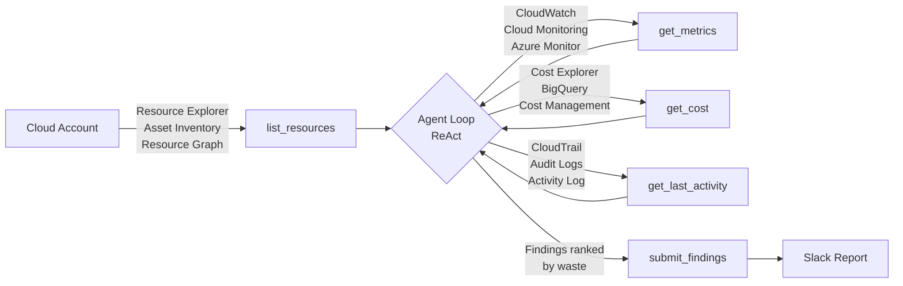

<div class="hero" markdown>

# Stop Wasting Money on Idle and Oversized Cloud Resources

**Argus** scans your AWS, GCP, and Azure accounts every week and delivers a prioritized,
AI-reasoned cost report straight to Slack — identifying idle resources to delete *and*
over-provisioned resources to right-size, with specific actions and estimated savings for each.

<div class="hero-buttons" markdown>
[Get Started](getting-started/index.md){ .md-button .md-button--primary }
[View on GitHub](https://github.com/vamshisiddarth/argus){ .md-button }
</div>

<div class="cloud-badges" markdown>
<span class="cloud-badge cloud-badge--aws" markdown>:material-aws: AWS</span>
<span class="cloud-badge cloud-badge--gcp" markdown>:material-google-cloud: GCP</span>
<span class="cloud-badge cloud-badge--azure" markdown>:material-microsoft-azure: Azure</span>
</div>

</div>

---

## :material-magnify: What Argus finds

<div class="feature-grid" markdown>

<div class="feature-card" markdown>
<div class="icon" markdown>:material-stop-circle-outline:</div>

**Stopped instances still charging**

EC2, GCE, and Azure VMs that are stopped but still paying for reserved storage and EIPs.
</div>

<div class="feature-card" markdown>
<div class="icon" markdown>:material-database-remove:</div>

**Orphaned volumes and disks**

EBS volumes, GCP Persistent Disks, and Azure Managed Disks with zero I/O for weeks.
</div>

<div class="feature-card" markdown>
<div class="icon" markdown>:material-lan-disconnect:</div>

**Idle load balancers and NAT gateways**

Resources processing zero bytes per day but billed by the hour.
</div>

<div class="feature-card" markdown>
<div class="icon" markdown>:material-arrow-collapse-down:</div>

**Right-sizing opportunities**

RDS `db.r5.4xlarge` at 4% CPU? EC2 `m5.4xlarge` with zero traffic? Argus names the
current instance type and recommends the exact smaller tier — not "consider downsizing."
</div>

<div class="feature-card" markdown>
<div class="icon" markdown>:material-server-minus:</div>

**Over-provisioned clusters and caches**

EKS, GKE, and AKS node groups, ElastiCache clusters, and Redshift nodes running at
single-digit utilization — with specific node count and instance type recommendations.
</div>

<div class="feature-card" markdown>
<div class="icon" markdown>:material-tag-remove:</div>

**Untagged and unowned resources**

Resources with no owner tag that nobody knows about — prime deletion candidates.
</div>

</div>

---

## :material-cog-play-outline: How it works



Argus uses a **ReAct agent loop** — the AI decides what to investigate, calls the right
tools in the right order, and reasons about idleness qualitatively. No hardcoded thresholds.
No rules per resource type. The same brain works across all three clouds.

---

## :material-slack: Example Slack report

```
Argus found $1,412.85/month in waste across 6 resources

🔴 HIGH  db-analytics-01  RDS db.r5.4xlarge   $1,240.00/mo
         CPU avg 4.2%, 2.1 connections over 90 days (Multi-AZ enabled)
         RIGHT-SIZE: db.r5.4xlarge → db.r5.xlarge · disable Multi-AZ → saves ~$900/mo

🔴 HIGH  cache-prod-001   ElastiCache r6g.xl  $142.00/mo
         CacheHitRate 91%, CurrConnections avg 3 over 90 days
         RIGHT-SIZE: cache.r6g.xlarge → cache.r6g.large · saves ~$71/mo

🔴 HIGH  i-0abc123def     EC2 t3.large         $28.40/mo
         CPU avg 0.0014% over 90 days, no CloudTrail events
         Recommendation: Terminate or snapshot and delete

🟡 MED   nat-0def456      NAT Gateway          $10.80/mo
         Zero bytes transferred in 90 days
         Recommendation: Delete — no traffic routing through this gateway

🟡 MED   vol-orphan       EBS 100 GiB gp3       $8.00/mo
         Unattached, zero I/O since creation
         Recommendation: Snapshot and delete

🟢 LOW   eipalloc-xyz     Elastic IP             $3.65/mo
         Unassociated since account creation
         Recommendation: Release the IP
```

---

## :material-rocket-launch-outline: Quick start

=== "Local scan (5 minutes)"

    ```bash
    git clone https://github.com/vamshisiddarth/argus.git
    cd argus
    python3.11 -m venv .venv && source .venv/bin/activate
    pip install -e ".[dev]"

    cp .env.example .env
    # Set ANTHROPIC_API_KEY and DRY_RUN=true

    argus scan --cloud aws --dry-run
    ```

=== "AWS Lambda (one-click)"

    [](https://console.aws.amazon.com/cloudformation/home#/stacks/create/review?templateURL=https://argus-releases.s3.amazonaws.com/latest/single-account.yaml)

    Or via CLI:

    ```bash
    aws cloudformation deploy \
      --template-file deploy/aws/single-account/template.yaml \
      --stack-name Argus \
      --capabilities CAPABILITY_IAM \
      --parameter-overrides \
          SlackWebhookUrl=https://hooks.slack.com/services/... \
          PrimaryRegion=us-east-1
    ```

=== "GCP Cloud Run"

    ```bash
    export GOOGLE_CLOUD_PROJECT=my-project
    export SLACK_WEBHOOK_URL=https://hooks.slack.com/services/...
    bash deploy/gcp/deploy.sh
    ```

=== "Azure Function"

    ```bash
    az deployment group create \
      --resource-group Argus-RG \
      --template-file deploy/azure/function-app.bicep \
      --parameters \
          subscriptionIds="sub-id-1,sub-id-2" \
          slackWebhookUrl="https://hooks.slack.com/services/..."
    ```

---

## :material-shield-check-outline: Design principles

| | Principle | What it means |
|--|-----------|---------------|
| :material-brain: | **Same brain, different hands** | `core/` is pure Python — zero cloud imports. Adapters are the only place SDKs live. |
| :material-robot-outline: | **AI drives the analysis** | No hardcoded idle thresholds. Claude reasons about each resource in context. |
| :material-lock-outline: | **Least privilege always** | Read-only IAM roles. No write permissions ever requested. |
| :material-lightning-bolt-outline: | **Batch everything** | One Cost Explorer call per scan. One Bedrock call per scan. Cost control by design. |
| :material-alert-circle-outline: | **Fail loudly** | Typed exceptions from adapters. No silent swallowing of errors. |

---

!!! tip "Total cost of a weekly scan"
    A full AWS scan across 100 resources costs roughly **$0.25–0.50** using the Anthropic API
    (direct key) or **~$0.10** via AWS Bedrock. A single right-sizing recommendation
    (e.g. `db.r5.4xlarge → db.r5.xlarge`) typically saves **100–1,000× the scan cost** per month.
